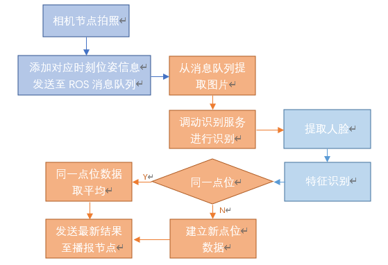
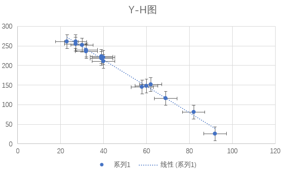

# 概要
本仓库是全国大学生智能汽车竞赛讯飞智能餐厅组别南航猫猫子带带我队的视觉识别代码仓库  
开源代码版本为20210819国赛代码，在下赛季比赛结束前本仓库不再维护  

  
## 前言

#### 本仓库使用`GPL-3.0`协议开源，请在协议要求内使用本仓库代码  
#### 注意：任何使用了本仓库代码的程序需要在显要位置标明本仓库地址，并使用`GPL-3.0`协议开源
  
#### 本仓库视觉识别代码基于 [tensorrtx](https://github.com/wang-xinyu/tensorrtx) 项目编写

阿巴阿巴这次比赛里面虽然我们的车没能完赛，导航部分就不放出来了，这里开源的是视觉部分的代码，希望能给各位提供一点参考  
参考[规则链接](https://blog.csdn.net/zhuoqingjoking97298/article/details/119579532)

## 运行要求
本代码运行需要TensorRT 4\~7，ROS melodic环境  
目前仅在讯飞mini版本小车上进行过编译测试  
使用讯飞小车摄像头在480P分辨率下进行测试，7号位可不停车识别，1\~5号位仅需在C区入口进行两次拍照，效率极高，相关配置均可通过配置文件快速调整
（配置文件位于`ucamera`包中）

## 目录结构
所有代码均位于本仓库src目录下  
`detect_server2`为识别控制器，采用先进先出队列对待识别图片进行控制，对相同点位拍摄的图片进行取平均，对不同点位识别结果相加  
`retinaface5`为识别节点，提供识别服务  
> 我们初期测试过使用传统算法来进行头发和眼镜特征的识别，其中眼镜识别效果不理想未提供文件，长头发识别可参考本包下`hair.cpp`文件  
> `glass.cpp`文件为采用模板匹配对人物进行识别（后面懒得改名字了）  
> 在运行本包前，需要在`engine`目录下放置名为`retina_r50.engine`的引擎文件，该文件获取见tensortx项目trt4分支retinaface文件夹  
> 另外其实retina_mnet的精准度也不错，运行速度比r50快得多，但是我没找到mnet的trt4版本，如果可以移植过来效果应该会好不少

`ucamera`和`ucamera_debug`为两个视频输出节点，一个用于常规运行，仅在运行到指定点位时发送识别数据以节省资源，另一个一直发送用于调试

## 详细技术文档
  
图中深蓝色为相机节点，橘黄色为识别控制节点，浅蓝色为识别节点。  
  
在提取人脸的过程中，我们使用TensorRT加速RetinaFace模型的运行，使其能在480P下达到2FPS的识别速度。在特征提取中，我们测试了颜色提取、边缘提取、模板匹配等方案。  
  
颜色提取算法中，我们将图片进行自动白平衡与自动色阶的调整后转换为YCbCr色彩空间，然后提取头发区域，通过判断该区域大小与位置判断是否为长头发，该算法在识别长头发特征中具有较好的鲁棒性与稳定性；  
  
边缘提取为原定识别眼镜特征的方案，通过提取图片边缘与轮廓后，寻找RetinaFace识别中识别到的眼睛特征点的第一层父轮廓，通过判断其长度确定是否存在眼镜特征，但该算法虽在图片上表现较好，但受限于实际相机的分辨率与运动模糊，在机器人上实际表现不佳；  
  
在赛方公布本次比赛中只存在已公布的7个人物后，我们编写了模板匹配算法，通过RetinaFace提取出人物脸部区域，并缩放至固定大小，然后进行模板匹配，在实际运行过程中也具有较好的表现。  
  
为了应对赛场周边可能出现的裁判、队员等人物对识别造成的干扰，我们设计了一套防干扰算法。由于在比赛中，所有人物脸部均位于同一水平面上，故所有人物的脸部的垂线与相机水平面构成的三角形均构成相似三角形，即人物脸部的bbox的y坐标与高度成线性关系，在固定相机角度后，我们做出以下分析图，可见Y坐标预测值与真实值差距约在20像素以内，我们认为当预测值与真实值之差的绝对值大于25时为误识别人脸，经实际测试，该算法对排除场外人员干扰有较好效果。   
  
